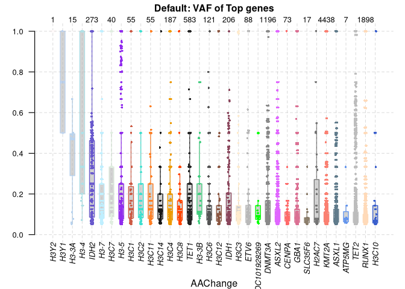
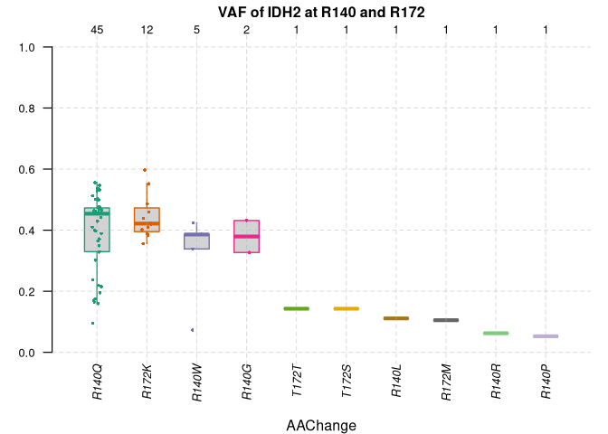
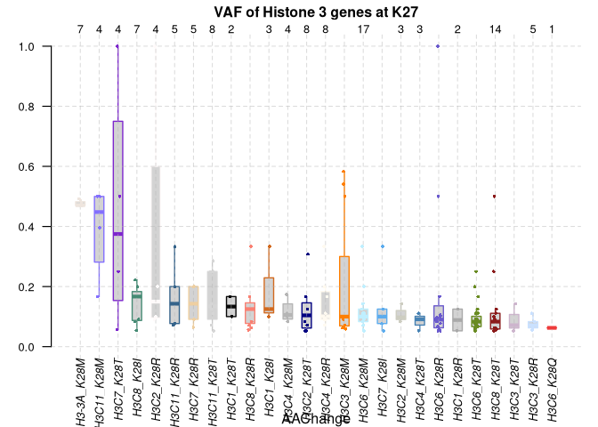
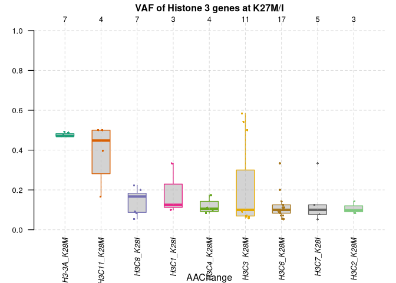
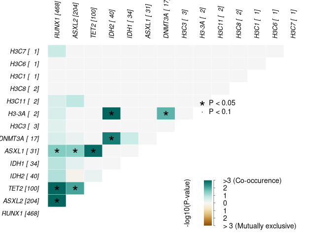
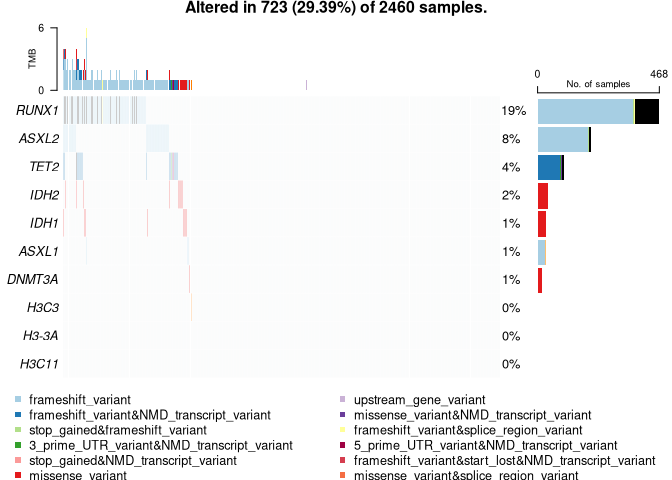
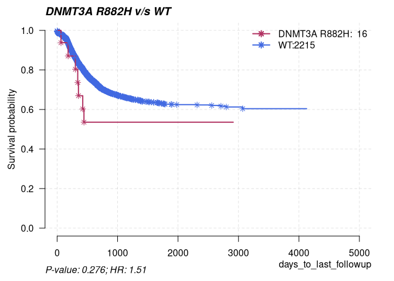
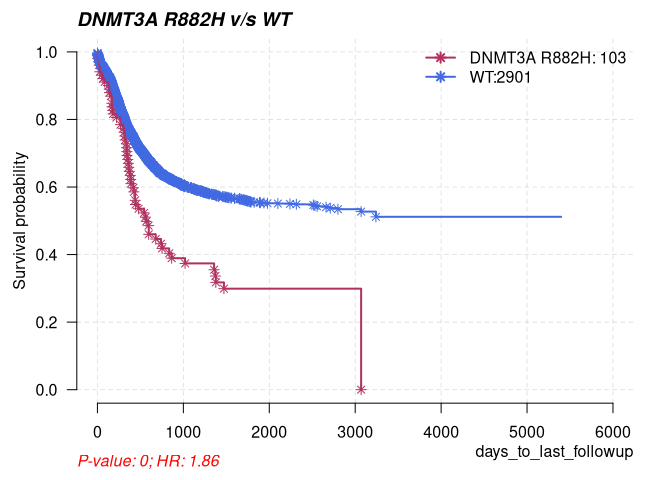

BamSliceR: From Tallied reads to Visualization
================
trichelab
02/14/2024

``` r
knitr::opts_chunk$set(fig.path='Figs/')
```

## Case Study: Pediatric Acute Myeloid Leukemia (AML) onco-histone mutations

To investigate the genetic landscape of lysine-to-Methionine mutation at
27th animo acid of Histone 3 genes (H3K27M) in AML across ages, we
examined 11 histone 3 genes as well as genes encoding epigenetic factors
that are frequently mutated in AML patients (*IDH1/2*, *DNMT3A*,
*RUNX1*, *ASXL1/2* and *TET1/2*).

#### Downloading & Tallying

Details on how to download sliced BAM files followed by tallying the
reads, see the
[README](https://github.com/trichelab/bamSliceR/tree/main).

### Annotation of Variants

A VRanges object will be generated from tallying reads from BAM files,
contains all the putative variants. sampleNames() can be used to see the
name of BAM files which variants detected from. Here, We present an
example on how to annotate variants with predicted consequence using
[VariantAnnotation](https://bioconductor.org/packages/release/bioc/html/VariantAnnotation.html)
and Ensembl Variant Effect Predictor
([VEP](https://useast.ensembl.org/info/docs/tools/vep/index.html)).

We started from a VRanges output from tallyReads().

``` r
library(bamSliceR)

tallied_reads = system.file("data", "tallied_reads_example.rds", 
                            package = "bamSliceR")

tallied_reads_vr = readRDS(tallied_reads)

# VRanges-specific methods such as altDepth(), refDepth(), totalDepth() would not
# availiable after conversion to GRanges. So save those info now.
tallied_reads_vr = saveVRinfo(tallied_reads_vr)

# Match back the metadata of BAM files to the VRanges
file_meta = getGDCBAMs("TARGET-AML", "RNA-Seq", "STAR 2-Pass Genome")
tallied_reads_vrinfo_baminfo = annotateWithBAMinfo(tallied_reads_vr, file_meta)

# Only keep variants with variant allele frequency greater than 5%.
tallied_reads_vrinfo_baminfo = subset(tallied_reads_vrinfo_baminfo, VAF > 0.05)
```

#### VariantAnnotation

Consequence of variants now can be predicted using
[VariantAnnotation](https://bioconductor.org/packages/release/bioc/html/VariantAnnotation.html):

``` r
getVariantAnnotation(tallied_reads_vrinfo_baminfo) -> tallied_reads_vrinfo_baminfo_gr
```

#### Ensembl Variant Effect Predictor (VEP)

Consequence of variants also can be predicted using Variant Effect
Predictor
([VEP](https://useast.ensembl.org/info/docs/tools/vep/index.html)). The
code below shows how to generate VCF file as input for VEP:

``` r
gr2vrforVEP(tallied_reads_vrinfo_baminfo, file = paste0(tempdir(), "/INPUT_VCF_FILE.vcf") , 
            writeToVcf = TRUE) -> vr

head(vr)
```

    ## VRanges object with 6 ranges and 1 metadata column:
    ##       seqnames    ranges strand         ref              alt     totalDepth
    ##          <Rle> <IRanges>  <Rle> <character> <characterOrRle> <integerOrRle>
    ##   [1]     chr1 143894587      *           C                A              2
    ##   [2]     chr1 143894592      *           A                G              2
    ##   [3]     chr1 143894604      *           G                T              1
    ##   [4]     chr1 143894701      *           A                C              8
    ##   [5]     chr1 143894711      *           G                A              1
    ##   [6]     chr1 143894815      *           A                T              2
    ##             refDepth       altDepth   sampleNames softFilterMatrix |
    ##       <integerOrRle> <integerOrRle> <factorOrRle>         <matrix> |
    ##   [1]              1              1           VEP                  |
    ##   [2]              1              1           VEP                  |
    ##   [3]              0              1           VEP                  |
    ##   [4]              7              1           VEP                  |
    ##   [5]              0              1           VEP                  |
    ##   [6]              1              1           VEP                  |
    ##                    index
    ##              <character>
    ##   [1] chr1:143894587_C/A
    ##   [2] chr1:143894592_A/G
    ##   [3] chr1:143894604_G/T
    ##   [4] chr1:143894701_A/C
    ##   [5] chr1:143894711_G/A
    ##   [6] chr1:143894815_A/T
    ##   -------
    ##   seqinfo: 2779 sequences from an unspecified genome; no seqlengths
    ##   hardFilters: NULL

Details about how to run Variant Effect Predictor can be found in
([ensemblVEP](https://bioconductor.org/packages/release/bioc/html/ensemblVEP.html))
or ([VEP](https://useast.ensembl.org/info/docs/tools/vep/index.html)).

The VCF file with variant effect predicted can be annotated back to
patients’ variants.

``` r
#Example vcf file with variant effect predicted.
library(ensemblVEP)
# Output VCF file from VEP
vep_file = system.file("extdata", "TARGET_AML_VRforVEP_vep.vcf", package = "bamSliceR")

#Extract the predicted consequences of variants from VEP
csqFromVEP = getCSQfromVEP(vep_file)

#Annotated the variants with VEP predicted consequences
tallied_reads_vrinfo_baminfo_annotated_gr = getVEPAnnotation(tallied_reads_vrinfo_baminfo_gr, 
                                                             csqFromVEP)
```

### Visualization

To facilitate downstream analysis of variants from patients, bamSliceR
provides customized plotVAF() function based on the maftools::plotVaF()
from
[maftools](https://www.bioconductor.org/packages/release/bioc/vignettes/maftools/inst/doc/maftools.html)
to help user to investigate the Variant Allele Frequency of the selected
variants.

Also, bamSliceR provides utility that allow conversion of GRanges to MAF
format file, which is compatible with maftools. Oncoplots, survival
analysis, and mutual exclusive test, etc, can then be implemented
easily.

#### Distribution of VAF

By default, the plotVAF would plot the distribution of VAF in top genes.

``` r
library(bamSliceR)

TARGET_AML_RNA_annotated_file = system.file("data", "TARGET_AML_RNA_annotated.gr.rds", 
                            package = "bamSliceR")

tallied_reads_vrinfo_baminfo_annotated_gr = readRDS(TARGET_AML_RNA_annotated_file)
plotVAF(tallied_reads_vrinfo_baminfo_annotated_gr, title = "Default: VAF of Top genes")
```

<!-- -->

By specifying single gene and multiple coordinates against the gene
products, the plotVAF() would plot distribution of VAF in selected loci
of the gene.

``` r
plotVAF(tallied_reads_vrinfo_baminfo_annotated_gr, genes = "IDH2", 
        bySingleLocus = c(140, 172), title = "VAF of IDH2 at R140 and R172")
```

<!-- -->

By specifying multiple genes and single coordinate against the genes’
products, the plotVAF() would plot distribution of VAF in selected loci
of the gene.

``` r
histone_genes <- c(
  HIST1H3A = "H3C1",
  HIST1H3B = "H3C2",
  HIST1H3C = "H3C3",
  HIST1H3D = "H3C4",
  HIST1H3E = "H3C6",
  HIST1H3F = "H3C7",
  HIST1H3G = "H3C8",
  HIST1H3H = "H3C10",
  HIST1H3I = "H3C11",
  HIST1H3J = "H3C12", H3F3A = "H3-3A"
)

plotVAF (tallied_reads_vrinfo_baminfo_annotated_gr, 
         genes = histone_genes, 
         bySingleLocus = c(28), title = "VAF of Histone 3 genes at K27")
```

<!-- -->

Plotting the VAFf distribution of two hotspot H3K27M & H3K27I, which
were previously documented have deleterious effect in pediatric brain
tumor.

``` r
plotVAF (tallied_reads_vrinfo_baminfo_annotated_gr, 
         genes = histone_genes, 
         groupByAAchanges = c("K28M", "K28I"), 
         title = "VAF of Histone 3 genes at K27M/I")
```

<!-- -->

### Covert to MAF file format

Example of how to convert GRanges to MAF format file.

``` r
TARGET_AML_RNA_annotated_filtered_file = system.file("data", 
                                                   "TARGET_AML_RNA_annotated_filtered.rds", 
                                                   package = "bamSliceR")
TARGET_AML_RNA_annotated_filtered.gr = readRDS(TARGET_AML_RNA_annotated_filtered_file)
```

#### Keep sample from sinlg-run and one timepoint

Patients in TARGET-AML usually have multiple sequencing runs from
multiple timepoints. The downstream statistical analysis from maftools
would NOT take account the multi-run and multi-timepoints senario for
each patients. In this case, when converting to MAF format, we recommend
user to specify the sample type and only keep single sequencing run of
the patient.

All the options of sample types in GDC data base can be view as below:

``` r
bamSliceR:::GDC_SAMPLE_TYPE
```

    ##  [1] "Recurrent Blood Derived Cancer - Bone Marrow"           
    ##  [2] "Primary Blood Derived Cancer - Bone Marrow"             
    ##  [3] "Primary Blood Derived Cancer - Peripheral Blood"        
    ##  [4] "Recurrent Blood Derived Cancer - Peripheral Blood"      
    ##  [5] "Bone Marrow Normal"                                     
    ##  [6] "Next Generation Cancer Model"                           
    ##  [7] "Blood Derived Cancer - Bone Marrow, Post-treatment"     
    ##  [8] "Blood Derived Normal"                                   
    ##  [9] "Cell Lines"                                             
    ## [10] "Blood Derived Cancer - Peripheral Blood, Post-treatment"

We now collect the variants of samples derived from primary disease.

``` r
TARGET_AML_RNA_annotated_primary_gr = keepSampleType(TARGET_AML_RNA_annotated_filtered.gr, 
                                                     sample_type = "primary", 
                                                     keepUniquePatient = TRUE)
table(TARGET_AML_RNA_annotated_primary_gr$sample_type)
```

    ## 
    ##      Primary Blood Derived Cancer - Bone Marrow 
    ##                                             880 
    ## Primary Blood Derived Cancer - Peripheral Blood 
    ##                                             157

#### GRanges to MAF format

Now we can convert the GRanges to MAF format.

``` r
grToMAF(TARGET_AML_RNA_annotated_primary_gr, 
        file = "~/TARGET_AML_RNA_annotated_primary_maf.tsv") -> TARGET_AML_RNA_annotated_primary_maf

head(TARGET_AML_RNA_annotated_primary_maf)
```

    ##   Hugo_Symbol Entrez_Gene_Id NCBI_Build Chromosome Start_Position End_position
    ## 1       RUNX1            861         38      chr21       34859541     34859541
    ## 2        TET2          54790         38       chr4      105236722    105236722
    ## 3       RUNX1            861         38      chr21       34880652     34880652
    ## 4       RUNX1            861         38      chr21       34880652     34880652
    ## 5       RUNX1            861         38      chr21       34880652     34880652
    ## 6       ASXL1         171023         38      chr20       32434601     32434601
    ##   Strand                    Variant_Classification Variant_Type
    ## 1      -                        frameshift_variant          INS
    ## 2      + frameshift_variant&NMD_transcript_variant          INS
    ## 3      -                        frameshift_variant          INS
    ## 4      -                        frameshift_variant          INS
    ## 5      -                        frameshift_variant          INS
    ## 6      +                        frameshift_variant          DEL
    ##   Reference_Allele Tumor_Seq_Allele1 Tumor_Seq_Allele2 Tumor_Sample_Barcode
    ## 1                G                 G                GG               PABGKN
    ## 2                T                 T                TT               PABGKN
    ## 3                T                 T                TT               PABGKN
    ## 4                T                 T                TT               PABHET
    ## 5                T                 T                TT               PABHHH
    ## 6               AC                AC                 A               PABHKY
    ##   Protein_Change i_TumorVAF_WU i_transcript_name
    ## 1            170             1   ENST00000300305
    ## 2            927             1   ENST00000265149
    ## 3            125             1   ENST00000300305
    ## 4            125             1   ENST00000300305
    ## 5            125             1   ENST00000300305
    ## 6            630             1   ENST00000306058

#### Prepare Clinical Data

Clinical information is optional but recommended in maftools, because
many downstream analysis is depended on.

``` r
TARGET_AML_clinical_file = system.file("extdata", "TARGET_AML_clinical_maf.tsv", package = "bamSliceR")
```

#### Maintain Sample Size for read.maf()

One last step before using maftools::read.maf() to create a maf object,
We need to add some dummy variants to the MAF file, so that the
read.maf() would not filtered the patients without any variants. For
example, the clinical data includes 500 patients, but for the genes we
selected, there are 200 patients don’t have any variants or mutations in
those selected genes. In this case, read.maf() would shrink the sample
size from 500 to 300, because those 200 patients without any variants
would not present in the input maf file. (more information can be found
[here](https://github.com/PoisonAlien/maftools/issues/159).).

To maintain the sample size when using read.maf(), we provide
generateDummyVariants() to add dummy variants to maf file. These dummy
variants will not affect the results from downstream analysis performed
by maftools, if user correctly specify the ‘vc_nonSyn’ with valid type
of variants.

Example:

``` r
# Collect the ID of all patients
TARGET_AML_clinical = read.delim(TARGET_AML_clinical_file)
TARGET_all_patient_IDs = TARGET_AML_clinical$Tumor_Sample_Barcode

# Generate dummy variants for those patients without any mutations.
TARGET_AML_RNA_annotated_primary_all_patients_maf = generateDummyVariants(patients_ID = TARGET_all_patient_IDs, 
                                                                          maf.df = TARGET_AML_RNA_annotated_primary_maf,
                                                                          file = "~/TARGET_maf_dummyAdded.tsv")

head(TARGET_AML_RNA_annotated_primary_all_patients_maf)
```

    ##   Hugo_Symbol Entrez_Gene_Id NCBI_Build Chromosome Start_Position End_position
    ## 1       RUNX1            861         38      chr21       34859541     34859541
    ## 2        TET2          54790         38       chr4      105236722    105236722
    ## 3       RUNX1            861         38      chr21       34880652     34880652
    ## 4       RUNX1            861         38      chr21       34880652     34880652
    ## 5       RUNX1            861         38      chr21       34880652     34880652
    ## 6       ASXL1         171023         38      chr20       32434601     32434601
    ##   Strand                    Variant_Classification Variant_Type
    ## 1      -                        frameshift_variant          INS
    ## 2      + frameshift_variant&NMD_transcript_variant          INS
    ## 3      -                        frameshift_variant          INS
    ## 4      -                        frameshift_variant          INS
    ## 5      -                        frameshift_variant          INS
    ## 6      +                        frameshift_variant          DEL
    ##   Reference_Allele Tumor_Seq_Allele1 Tumor_Seq_Allele2 Tumor_Sample_Barcode
    ## 1                G                 G                GG               PABGKN
    ## 2                T                 T                TT               PABGKN
    ## 3                T                 T                TT               PABGKN
    ## 4                T                 T                TT               PABHET
    ## 5                T                 T                TT               PABHHH
    ## 6               AC                AC                 A               PABHKY
    ##   Protein_Change i_TumorVAF_WU i_transcript_name
    ## 1            170             1   ENST00000300305
    ## 2            927             1   ENST00000265149
    ## 3            125             1   ENST00000300305
    ## 4            125             1   ENST00000300305
    ## 5            125             1   ENST00000300305
    ## 6            630             1   ENST00000306058

#### Create maf object

Now, we can create MAF object using maftools::read.maf :

``` r
library(maftools)
# Valid or nonSyn type of variants, exlucde the "dummy" entity.
target.maf.nonSyn = unique(TARGET_AML_RNA_annotated_primary_maf$Variant_Classification)

# Path to maf file
TARGET_maf_file = system.file("extdata", "TARGET_maf_dummyAdded.tsv",
                              package = "bamSliceR")
# Path to clinical data
TARGET_clinical_file = system.file("extdata", "TARGET_AML_clinical_maf.tsv",
                                  package = "bamSliceR")

TARGET_maf = read.maf(maf = TARGET_maf_file, 
                      clinicalData = TARGET_clinical_file, 
                      vc_nonSyn = target.maf.nonSyn)
```

    ## -Reading
    ## -Validating
    ## --Removed 7 duplicated variants
    ## --Non MAF specific values in Variant_Classification column:
    ##   frameshift_variant
    ##   frameshift_variant&NMD_transcript_variant
    ##   stop_gained&frameshift_variant
    ##   upstream_gene_variant
    ##   downstream_gene_variant
    ##   3_prime_UTR_variant&NMD_transcript_variant
    ##   stop_gained&NMD_transcript_variant
    ##   missense_variant
    ##   stop_gained
    ##   missense_variant&NMD_transcript_variant
    ##   frameshift_variant&splice_region_variant
    ##   5_prime_UTR_variant&NMD_transcript_variant
    ##   frameshift_variant&start_lost&NMD_transcript_variant
    ##   missense_variant&splice_region_variant
    ##   dummy
    ## -Silent variants: 1733 
    ## -Summarizing
    ## -Processing clinical data
    ## --Annotation missing for below samples in MAF:
    ##   PASRRG
    ##   PASZZJ
    ##   PATEAF
    ##   PATGVS
    ##   PATHKS
    ##   PATJVL
    ##   PATLBI
    ##   PATMXW
    ##   PATRME
    ##   PATSSY
    ##   PATTWY
    ##   PATVAV
    ##   PATVPI
    ##   PATVRA
    ##   PATWYU
    ##   PATZIS
    ##   PATZVF
    ##   PAUBKI
    ##   PAUBLN
    ##   PAUBWU
    ##   PAUEAN
    ##   PAUEBH
    ##   PAUFZU
    ##   PAUGAR
    ##   PAUGHD
    ##   PAUGNU
    ##   PAUHDR
    ##   PAUHGM
    ##   PAUHTE
    ##   PAUJBK
    ##   PAUKUL
    ##   PAUMCH
    ##   PAUMZV
    ##   PAUNIA
    ##   PAUNLX
    ##   PAUNYJ
    ##   PAUPTI
    ##   PAURMH
    ##   PAURPD
    ##   PAURYA
    ##   PAUTFD
    ##   PAUTKL
    ##   PAUVSU
    ##   PAUVWF
    ##   PAUVXN
    ##   PAUVYC
    ##   PAUWZR
    ##   PAUXKD
    ##   PAUXNR
    ##   PAUZBE
    ##   PAUZJX
    ##   PAUZYF
    ##   PAVAUA
    ##   PAVAUU
    ##   PAVDCL
    ##   PAVDDU
    ##   PAVDXR
    ##   PAVECZ
    ##   RO50375
    ##   RO50541
    ##   RO50650
    ## -Finished in 0.118s elapsed (0.554s cpu)

``` r
TARGET_maf
```

    ## An object of class  MAF 
    ##                                                       ID summary  Mean Median
    ##  1:                                           NCBI_Build      38    NA     NA
    ##  2:                                               Center      NA    NA     NA
    ##  3:                                              Samples    2460    NA     NA
    ##  4:                                               nGenes      14    NA     NA
    ##  5:           3_prime_UTR_variant&NMD_transcript_variant       3 0.001      0
    ##  6:           5_prime_UTR_variant&NMD_transcript_variant       2 0.001      0
    ##  7:                              downstream_gene_variant       5 0.002      0
    ##  8:                                   frameshift_variant     809 0.329      0
    ##  9:            frameshift_variant&NMD_transcript_variant      94 0.038      0
    ## 10:             frameshift_variant&splice_region_variant       5 0.002      0
    ## 11: frameshift_variant&start_lost&NMD_transcript_variant       3 0.001      0
    ## 12:                                     missense_variant      96 0.039      0
    ## 13:              missense_variant&NMD_transcript_variant       2 0.001      0
    ## 14:               missense_variant&splice_region_variant       1 0.000      0
    ## 15:                                          stop_gained       3 0.001      0
    ## 16:                       stop_gained&frameshift_variant       2 0.001      0
    ## 17:                   stop_gained&NMD_transcript_variant       1 0.000      0
    ## 18:                                upstream_gene_variant       4 0.002      0
    ## 19:                                                total    1030 0.419      0

#### Downstream analysis from maftools

Example of maftools::somaticInteractions().

``` r
me = somaticInteractions(maf = TARGET_maf, top = 50, pvalue = c(0.05, 0.1))
```

<!-- --> Example of
maftools::oncoplot().

``` r
oncoplot(maf = TARGET_maf, top = 10)
```

<!-- -->

Example of maftools::mafSurvival().

``` r
mafSurvival(maf = TARGET_maf, genes = c("DNMT3A"), groupNames = c("DNMT3A R882H", "WT"), 
            time = 'days_to_last_followup', Status = 'Overall_Survival_Status', isTCGA = TRUE)
```

    ## DNMT3A 
    ##     17 
    ##           Group medianTime    N
    ## 1: DNMT3A R882H      543.5   16
    ## 2:           WT     1260.0 2215

<!-- -->

Example of maftools::mafSurvival() on combined cohorts of TARGET-AML and
BEAT-AML.

``` r
TARGET_BEAT_AML_maf_file = system.file("extdata", "TARGET_BEAT_AML_maf_dummyAdded.tsv",
                              package = "bamSliceR")
TARGET_BEAT_AML_clinical_file = system.file("extdata", "TARGET_BEAT_AML_clinical.tsv",
                                 package = "bamSliceR")

all_maf = read.maf(maf = TARGET_BEAT_AML_maf_file, 
        clinicalData = TARGET_BEAT_AML_clinical_file, vc_nonSyn = target.maf.nonSyn)
```

    ## -Reading
    ## -Validating
    ## --Non MAF specific values in Variant_Classification column:
    ##   missense_variant
    ##   synonymous_variant
    ##   downstream_gene_variant
    ##   upstream_gene_variant
    ##   dummy
    ## -Silent variants: 2894 
    ## -Summarizing
    ## -Processing clinical data
    ## --Annotation missing for below samples in MAF:
    ##   2152
    ##   2443
    ##   PATEAF
    ##   PATVAV
    ##   RO50375
    ##   RO50541
    ## -Finished in 0.104s elapsed (0.384s cpu)

``` r
mafSurvival(maf = all_maf, genes = c("DNMT3A"), groupNames = c("DNMT3A R882H", "WT"), 
            time = 'days_to_last_followup', Status = 'Overall_Survival_Status', isTCGA = TRUE)
```

    ## DNMT3A 
    ##    111 
    ##           Group medianTime    N
    ## 1: DNMT3A R882H        387  103
    ## 2:           WT       1019 2901

<!-- -->
