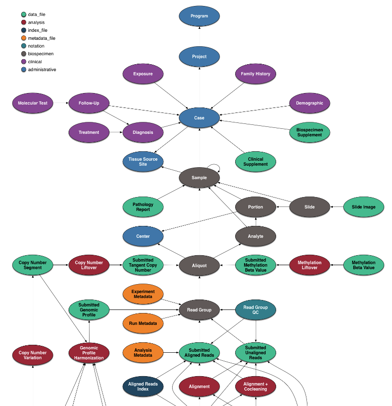
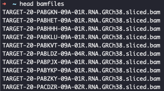
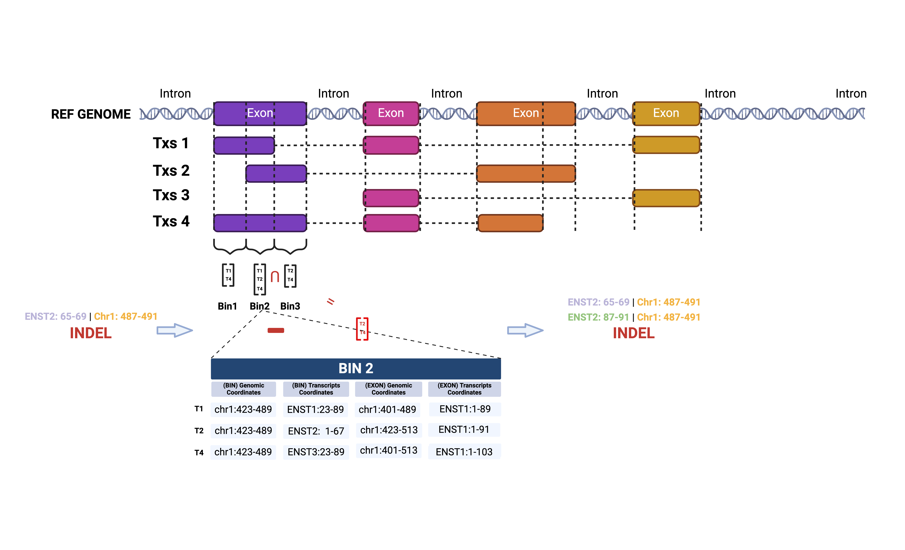
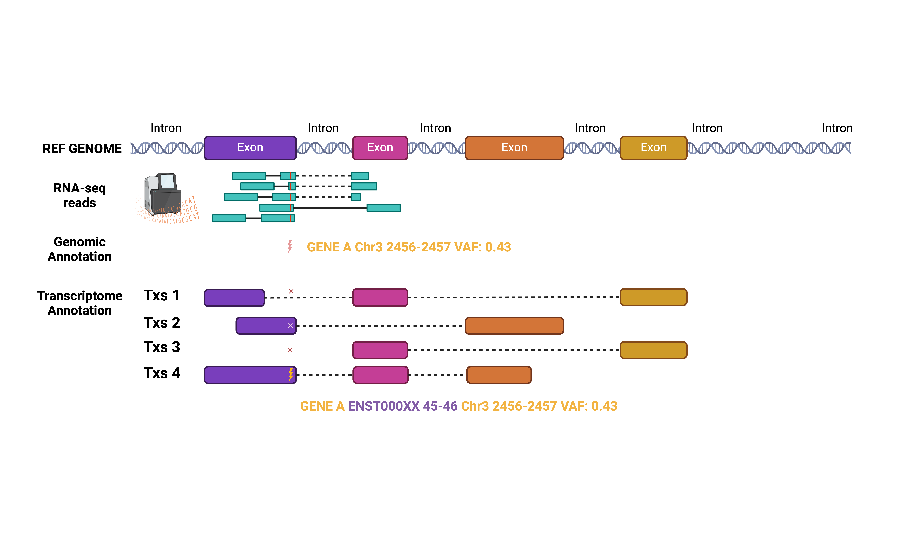

# Abstract
In this vignette, we will walk through the `bamSliceR` toolset to swiftly extract 
coordinate- or range-based aligned DNA and/or RNA sequence reads from the Genomic 
Data Commons [GDC](https://portal.gdc.cancer.gov/). We will then demonstrate the 
downstream functionality to tally and annotate variants from BAM files, whether 
they are stored in the cloud or locally. Also, we want to highlight the new 
utilities we implemented in the `bamSliceR` to facilitate transcript-aware 
variants annotation using transcriptome BAM that generated by aligning reads 
from RNA-seq to reference transcripts sequences (GENCODE v36).

We will use data from TARGET [@Bolouri2017-kp], BEAT-AML [@Tyner2018-ur] and 
Leucegene [@Lavallee2016-wx].

# Introduction
We developed `bamSliceR` to address two practical challenges: resource-sparing 
identification of candidate subjects, and variant detection from aligned 
sequence reads across thousands of controlled-access subjects. The GDC 
[@Wilson2017-oc] BAM Slicing API is a practical and well-documented REST API for 
this purpose. [@Morgan2017-zj]. Additionally, the `GenomicDataCommons` 
Bioconductor package implements the service in R interface, allowing for more 
efficient querying of data from the GDC. However, we find relatively little 
published work that uses the GDC API, even those evaluating specific candidate 
variants. Instead, researchers often rely on variant calls from previous studies, 
assuming a single best method for variant detection fits all experimental 
designs—a notion contradicted by various benchmarks. Alternatively, retrieving
and reanalyze raw sequence data, which is highly inefficient.

# Set-up

```{r setup0, message=FALSE, echo = FALSE}
options(digits=3)
options(width=90)
```

```{r setup, eval=TRUE, message=FALSE}
library(bamSliceR)
library(rtracklayer)
library(parallel)
library(ggplot2)
```

# `bamSliceR` pipeline

# Working with Genomic BAM files

## Download Bam Slices
The [data model for the GDC is complex](https://gdc.cancer.gov/developers/gdc-data-model). If you want query more 
other types of data, it may worth to overview the details. Here, we focus on
identifying the metadata of BAM files, followed by downloading the sliced BAM.

{width=550px}

#### Identify the BAM file of interest
We simplified the querying process in a single function to gather BAM files 
information from the project of interest. 

```{r baminfo}
file_meta = getGDCBAMs(projectId = "TARGET-AML", 
                       es = "RNA-Seq", 
                       workflow = "STAR 2-Pass Genome")
nrow(file_meta)
head(file_meta)
```

Three pieces of information are needed to locate the BAM files on GDC portal, 
which can be inspected by `availableProjectId()`, `availableExpStrategy()` and 
`availableWorkFlow()`, respectively.

1) The project ID. 
2) Experiment Strategy (ex. “RAN-Seq”, “WGS”, etc. ) 
3) Alignment workflow.

```{r inspection,message=FALSE, warning=FALSE}
availableProjectId() %>% head(n = 10)
availableExpStrategy("TARGET-AML")
availableWorkFlow(projectId = "TARGET-AML", es = "RNA-Seq")
```
#### Identify the Genomic Ranges of interest
BAM slicing API from GDC portal accept genomic ranges specifying as vector of 
character() e.g., c("chr", "chr1:10000"). Here we provide a function to get the 
required input format given the gene names.

```{r genes,message=FALSE}
target_genes_data = system.file("extdata", "gene_names.rds", package = "bamSliceR")
target_genes = readRDS(target_genes_data)
target_genes
```

Get either GRanges or vector of character() for exons of the genes.

```{r ranges,message=FALSE}
#Get GRanges for exons of all genes above
target_ranges_gr = getGenesCoordinates(target_genes, ret = "GRanges")
head(target_ranges_gr)

#Get the vector of character() instead.
target_ranges_chars = getGenesCoordinates(target_genes, ret ="DF", 
                                          extendEnds = 100)
head(target_ranges_chars)
```

#### Download sliced-BAM
```{r download, message=FALSE, eval = FALSE}
downloadSlicedBAMs(file_df = file_meta, 
                   regions = target_ranges_chars, 
                   dir = "BAM_FILES")
```

## Tally Variants from sliced BAMs
`bamSliceR` integrated functionality in Bioconductor package `gmapR` to tally 
coverage and counts of variant alleles followed by estimation of Variant Allele 
Fraction (VAF) of each variants.

```{r tallyreads, eval=TRUE}
```

#### Identify the Genomic Ranges of interest
We first also need to specify the regions as a `GRanges` object, which can be
a subset of genomic ranges used to sliced BAM files.

```{r message=FALSE}
head(target_ranges_gr)
```

#### Specify list of BAM files 
Then we need make a text file to include all the names of downloaded 
BAM files.

{width=400px height=200px}

```{bash, eval=FALSE}
cd DIR_BAM_FILES
ls | grep bam$ > bamfiles
```

In the directory of the downloaded BAM files, we then `scan` the 'bamfiles' into R.

```{r message=FALSE, eval = FALSE}
bamfiles_txt = system.file("extdata", "bamfiles", package = "bamSliceR")
bamfiles = scan(bamfiles_txt, "character")
```

#### Preparing `gmapGenome` Object
Last thing we need is to create a `gmapGenome` object, then specify the directory 
of it.

```{r message=FALSE, eval = FALSE}
#GmapGenome objects can be created from FASTA files or BSgenome objects. Below is 
#an example of how to create human hg38 gmapGenome from BSgenome.

library(gmapR)
library(BSgenome.Hsapiens.UCSC.hg38)

gmapGenomePath <- file.path("PATH/to/SAVE/gmapGenome", "hg38")
gmapGenomeDirectory <- GmapGenomeDirectory(gmapGenomePath, create = TRUE)

gmapGenome <- GmapGenome(genome=Hsapiens, 
                         directory=gmapGenomeDirectory,
                         name="hg38", create=TRUE) 
```

#### Tallying Reads
We can then start to tally the reads of BAM files.
If you want to run `tallyReads` on machine with multiple nodes, there are 
parameters to distribute the nodes according to number of BAM files and 
number of genomic ranges:

1) `parallelOnRanges`: if `TRUE`, will process the Genomic Ranges in parallel.
2) `parallelOnRangesBPPARAM`: configuration for parallel tallyreads on genomic ranges.
3) `BPPARAM`: configuration for parallel tallyreads on BAM files.

If we want to tally reads on thousands of BAM but only few gene regions, 
ideally we want to put more workers on computing on BAM files but 
less workers on granges regions.

```{r message=FALSE, eval = FALSE}
tallied_reads = tallyReads(bamfiles = bamfiles, gmapGenome_dir = gmapGenome_dir, 
                           grs = target_ranges,
                           BPPARAM = MulticoreParam(workers = 4 , stop.on.error = TRUE),
                           parallelOnRanges = TRUE,
                           parallelOnRangesBPPARAM = MulticoreParam(workers = 4) )
```

We also provide a bash template to run `tallyReads()` on HPC on large cohorts.

## Annotation of Variants tallied from Genomic BAM files

### Annotation of Variants 
A VRanges object will be generated from tallying reads from BAM files, contains 
all the putative variants. sampleNames() can be used to see the name of BAM files 
which variants detected from. Here, We present an example on how to annotate 
variants with predicted consequence using
[VariantAnnotation](https://bioconductor.org/packages/release/bioc/html/VariantAnnotation.html) and Ensembl Variant Effect Predictor ([VEP](https://useast.ensembl.org/info/docs/tools/vep/index.html)). 

We started from a VRanges output from tallyReads().
```{r message=FALSE,  warning=FALSE, echo='hide'}
library(bamSliceR)
tallied_reads = system.file("extdata", "tallied_reads_example.rds", 
                            package = "bamSliceR")
tallied_reads_vr = readRDS(tallied_reads)

# VRanges-specific methods such as altDepth(), refDepth(), totalDepth() would not
# availiable after conversion to GRanges. So save those info now.
tallied_reads_vr = saveVRinfo(tallied_reads_vr)

# Match back the metadata of BAM files to the VRanges
#file_meta = getGDCBAMs("TARGET-AML", "RNA-Seq", "STAR 2-Pass Genome")
tallied_reads_vrinfo_baminfo = annotateWithBAMinfo(tallied_reads_vr, file_meta)

# Only keep variants with variant allele frequency greater than 5%.
tallied_reads_vrinfo_baminfo = subset(tallied_reads_vrinfo_baminfo, VAF > 0.05)

```

#### VariantAnnotation ####
Consequence of variants now can be predicted using [VariantAnnotation](https://bioconductor.org/packages/release/bioc/html/VariantAnnotation.html):

```{r message=FALSE,  warning=FALSE, echo='hide'}

getVariantAnnotation(tallied_reads_vrinfo_baminfo) -> tallied_reads_vrinfo_baminfo_gr

```
#### Ensembl Variant Effect Predictor (VEP) ####
Consequence of variants also can be predicted using Variant Effect Predictor ([VEP](https://useast.ensembl.org/info/docs/tools/vep/index.html)).
The code below shows how to generate VCF file as input for VEP:
```{r message=FALSE,  warning=FALSE, echo='hide'}
gr2vrforVEP(tallied_reads_vrinfo_baminfo, file = "~/INPUT_VCF_FILE.vcf", 
            writeToVcf = TRUE) -> vr

head(vr)
```

Details about how to run Variant Effect Predictor can be found in ([ensemblVEP](https://bioconductor.org/packages/release/bioc/html/ensemblVEP.html)) or ([VEP](https://useast.ensembl.org/info/docs/tools/vep/index.html)).

The VCF file with variant effect predicted can be annotated back to patients' variants.
```{r message=FALSE,  warning=FALSE, echo='hide', eval=FALSE}
#Example vcf file with variant effect predicted.
# Output VCF file from VEP
vep_file = system.file("extdata", "TARGET_AML_VRforVEP_vep.vcf", package = "bamSliceR")

#Extract the predicted consequences of variants from VEP
csqFromVEP = getCSQfromVEP(vep_file)

#Annotated the variants with VEP predicted consequences
tallied_reads_vrinfo_baminfo_annotated_gr = getVEPAnnotation(tallied_reads_vrinfo_baminfo_gr, 
                                                             csqFromVEP)
```

### Visualization
To facilitate downstream analysis of variants from patients, bamSliceR provides 
customized plotVAF() function based on the maftools::plotVaF() from [maftools](https://www.bioconductor.org/packages/release/bioc/vignettes/maftools/inst/doc/maftools.html)
to help user to investigate the Variant Allele Frequency of the selected variants.

#### Distribution of VAF 

By default, the plotVAF would plot the distribution of VAF in top genes.
```{r message=FALSE,  warning=FALSE, echo='hide' }
library(bamSliceR)

TARGET_AML_RNA_annotated_file = system.file("extdata", "TARGET_AML_RNA_annotated.gr.rds", 
                            package = "bamSliceR")

tallied_reads_vrinfo_baminfo_annotated_gr = readRDS(TARGET_AML_RNA_annotated_file)
plotVAF(tallied_reads_vrinfo_baminfo_annotated_gr, title = "Default: VAF of Top genes")

```

By specifying single gene and multiple coordinates against the gene products, the plotVAF()
would plot distribution of VAF in selected loci of the gene.
```{r message=FALSE,  warning=FALSE, echo='hide' }
plotVAF(tallied_reads_vrinfo_baminfo_annotated_gr, genes = "IDH2", 
        bySingleLocus = c(140, 172), title = "VAF of IDH2 at R140 and R172")

```

By specifying multiple genes and single coordinate against the genes' products, the plotVAF()
would plot distribution of VAF in selected loci of the gene.
```{r message=FALSE,  warning=FALSE, echo='hide' }
histone_genes <- c(
  HIST1H3A = "H3C1",
  HIST1H3B = "H3C2",
  HIST1H3C = "H3C3",
  HIST1H3D = "H3C4",
  HIST1H3E = "H3C6",
  HIST1H3F = "H3C7",
  HIST1H3G = "H3C8",
  HIST1H3H = "H3C10",
  HIST1H3I = "H3C11",
  HIST1H3J = "H3C12", H3F3A = "H3-3A"
)

plotVAF (tallied_reads_vrinfo_baminfo_annotated_gr, 
         genes = histone_genes, 
         bySingleLocus = c(28), title = "VAF of Histone 3 genes at K27")

```

### Covert to MAF file format

Also, bamSliceR provides utility that allow conversion of GRanges to MAF format 
file, which is compatible with maftools. Oncoplots, survival analysis, and mutual 
exclusive test, etc, can then be implemented easily.

# Working with Transcriptome BAM files

## Why Transcriptome BAM ?
Understanding the transcript architecture of genes is crucial for annotating
variants determined by raw read counts from RNA-sequencing data. Overlooking or
biasing the transcript-specific context may lead to the misinterpretation of the 
disease-associated effects of these variants. 

We implemented in the `bamSliceR` to facilitate transcript-aware variants 
annotation using transcriptome BAM that generated by aligning reads from RNA-seq 
to reference transcripts sequences (GENCODE v36)[https://www.gencodegenes.org/human/release_36.html].
```{r message=FALSE,  warning=FALSE, echo='hide'}
library(rtracklayer)
library(bamSliceR)

leu.file = system.file("extdata", "leucegene.txs.tallied.reads.rds", package = "bamSliceR")
leu.tallied.reads = readRDS(leu.file)
leu.tallied.reads[,c("UPC_ID")] %>% head()
```

## Annotation of Variants tallied from Genomic BAM files

### Generate Trancriptomic GENCODE annotation GFF file
Transcriptome BAM files lack the information of genomic coordinates when mapping 
reads to reference transcripts sequences. Convention GFF3 files, from GENCODE for 
example, contains the gene annotation on the reference chromosomes, which are not 
compatible with Transcriptome BAM. 

```{r  message=FALSE,  warning=FALSE, echo='hide'}
library(rtracklayer)
library(bamSliceR)
coords.column.names = c("seqid", "type", "start", "end", "gene_name")

gencode.v36.file = system.file("extdata", "gencode.v36.annotation.subset.gff3", 
                             package = "bamSliceR")
gencode.v36.df = readGFF(gencode.v36.file)
gencode.v36.df[,coords.column.names]
```

In order to easily annotate the tallied variants from transcriptome BAM, 
we provide `get_txs_coords_of_gff()` to calculate the coordinates of transcripts 
for each features entity (except "gene" feature), based on the given genomic 
coordinates. The function would maintain the internal structure of the GFF3 file 
(for example, the hierarchy of the features for each genes.)

```{r message=FALSE,  warning=FALSE, echo='hide'}
genomic.column.names = c("g_seqid", "g_start", "g_end")
get_txs_coords_of_gff( gencode.file = gencode.v36.file, isSaveGenomicCoords = TRUE) -> gencode.v36.transcripts.df
gencode.v36.transcripts.df[,c(coords.column.names, genomic.column.names)]
```

### Find all Transcripts of Gene Compatible with a Variant
Transcripts that overlap with a variant but have few or no reads mapped to them 
may not be recorded or could be filtered out. However, these cases are still 
informative for addressing questions such as why mutated transcripts are not 
expressed, and whether the mutation triggers mechanisms like nonsense-mediated 
decay that eliminate the mutated transcripts. In this case, we want to re-tally
reads for these transcripts that compatible with the variant.

For each genes, `bamSliceR` has function `getDisjoinOverlapBins` to create 
disjoint bins that each bin contains the information of both transcriptome and
genomic coordinates of overlapped transcripts.
{width=600px}
```{r message=FALSE,  warning=FALSE, echo='hide'}
gencode.v36.txs.file = system.file("extdata", "gencode.v36.txs.annotation.subset.gff3", 
                             package = "bamSliceR")
getDisjoinOverlapBins(gencode.file.txs = gencode.v36.txs.file) -> gencode.v36.txs.bins

split(gencode.v36.txs.bins$transcript_id, gencode.v36.txs.bins$bin_tag)[1:10]
```

`fixMissingTxs()` would call `getDisjoinOverlapBins()` to find all transcripts
compatible with a variant.

```{r message=FALSE,  warning=FALSE, echo='hide'}
oneTxsVariant_file = system.file("extdata", "oneTxsVariant.rds", 
                             package = "bamSliceR")
bam.file.dir = system.file("extdata", package = "bamSliceR")
oneTxsVariant = readRDS(oneTxsVariant_file)
oneTxsVariant[,c("UPC_ID", "VAF")]
all_compatible_txs = fixMissingTxs(oneTxsVariant, 
                                   gencode.file.txs = gencode.v36.txs.file, 
                                   bam.file.dir = bam.file.dir)
all_compatible_txs[,c("UPC_ID", "VAF")]
```

### Annotation of Variants 

`bamSliceR` provide wrapper function `getVariantAnnotationForTxs()` to annotate 
Variants by: 

1) making customized `TxDb` object given the `gencode.gff3` file
2) calling `getVariantAnnotation.Txs()` & `getGenCodeAnnotation.Txs()`   
3) merging annotation results from two sources.

#### Predict Consequence of Variants
Similar to annotate variants from genomic BAM files, we use `VariantAnnotation`
to predict consequence of variants in `getVariantAnnotation.Txs()`. 

The only difference is that we need:
1) Create a `txdb` object from GENCODE annotation
file in GFF3 format that contains information of both genomic and transcriptome
coordinates.
2) `Fasta` file contains nucleotide sequences of transcripts.

```{r message=FALSE,  warning=FALSE, echo='hide'}
# Create txdb object
gencode.v36.txs.file = system.file("extdata", "gencode.v36.txs.annotation.subset.gff3", 
                             package = "bamSliceR")
gencode.gr <- import(gencode.v36.txs.file, format="gff3")
metadata = data.frame(name = c("Data source", "Organism","Taxonomy ID", "miRBase build ID"),
                        value= c("GENCODE.v36", "Homo sapiens", "9606", NA))
txdb <- suppressWarnings(makeTxDbFromGRanges(gencode.gr, metadata = metadata))

#getVariantAnnotation.Txs
seqSource = system.file("extdata", "gencode.v36.transcripts.subset.fa",
                        package = "bamSliceR")
leu.tallied.reads.annotated = getVariantAnnotation.Txs(leu.tallied.reads, 
                                                       txdb = txdb, 
                                                       seqSource = seqSource)
leu.tallied.reads.annotated[,c("UPC_ID",bamSliceR:::.VARIANT_ANNOTATE_INFO[1:14])]
```

#### Mapping locus with features of Variants.

`getGenCodeAnnotation.Txs()` will map the locus with features of variants also from
GENCODE annotation file in GFF3 format that contains information of both genomic 
and transcriptome coordinates. But this function not only focus on CDS regions,
but also UTR/STOP/START regions. Further, it will match the transcriptome coordinates 
of locus with genomic coordinates.

```{r message=FALSE,  warning=FALSE, echo='hide'}
leu.tallied.reads.gencode = getGenCodeAnnotation.Txs(leu.tallied.reads, 
                                                     gencode.file.txs = gencode.v36.txs.file)
leu.tallied.reads.gencode[,c("UPC_ID",bamSliceR:::.GRvsTXS_INFO )]
```

#### Merge annotation results from two sources

In practice, `getVariantAnnotationForTxs()` can be used to retrieve annotation
results from both sources.
```{r message=FALSE,  warning=FALSE, echo='hide'}
leu.tallied.reads.annoted = getVariantAnnotationForTxs(gencode.file.txs = gencode.v36.txs.file, 
                                                       seqSource = seqSource,
                                                       query.ranges = leu.tallied.reads)
leu.tallied.reads.annoted
```

# Using Genomic VAF as Prior to Infer Transcripts' VAF
{width=550px}

We now have both Genomic and Transcriptome annotation for each variants. Specifically,
We know the ref and alt read counts and VAF from genomic alignment that mapped 
reads to the linear reference genome. We also have such information for each
transcripts of the gene by mapping reads against transcripts' sequences. Now,
the question is how can we infer which transcript carried the variants being 
expressed based on the reads mapping evidence.

Rather than pretending that all of the evidence has equal weight, we instead can 
test for the null that each compatible transcript has a VAF generated from the 
same underlying distribution sampled by genomic VAF of variant (g_VAF) with 
total_depth trials. Then our prior would be Pr(variant on transcript X) == Pr(variant on gDNA),
when g_VAF follows Beta distribution Beta(g_depth_ref, g_depth_alt).
 
$$
t_{\text{VAF}} \approx g_{\text{VAF}} \sim \text{Beta}(g_{\text{depth_alt}}, g_{\text{depth_ref}})
$$


$$
t_{\text{depth_alt}} \sim \text{Binom}(t_{\text{depth_total}}, g_{\text{VAF}})
$$
 
For example:
```{r message=FALSE,  warning=FALSE, echo='hide'}
#contains all recurrent variants that compatible with more than one transcripts
gVSt_file = system.file("extdata", "GvsT_recurrent_multiTxs_list.rds", 
                             package = "bamSliceR")
GvsT_recurrent_multiTxs_list = readRDS(gVSt_file)

#one patient one variant
demo = GvsT_recurrent_multiTxs_list[[16]][1:4,]
demo

plotHistAsDist = function(data, binwidth = 0.001, i)
{
  data = data.frame(d = 1:nrow(data), average = data[,i])
  ggplot(data, aes(x = average)) +
    geom_histogram(binwidth = binwidth, fill = "blue", color = "black", alpha = 0.7) +
    labs(title = "Distribution of True Averages",
         x = "True Average",
         y = "Frequency") +
    theme_minimal()
}

#Example:V = "chr15:90085321:90085321:T:C" patient:"02H060"
#g_VAF = 0.0967423
#g_altDepth = 98
#g_refDepth = 911
#EC:"ENST00000330062.8", "ENST00000560061.1", "ENST00000559482.5", "ENST00000540499.2"

#model 1: VAF(ENST00000330062.8) == g_VAF(V)
#t_totalDepth(ENST00000330062.8) == 258
#t_altDepth(ENST00000330062.8) == 10
#t_refDepth(ENST00000330062.8) == 248
#1) assume that in model 1 the prior distribution for theta(VAF)
# is Beta(g_altDepth, g_refDepth) == Beta(98, 911) 
# The observed data for "ENST00000330062.8" tells us that there
# are 258 "bernoulli trails"(txs total depth), and 10 "success" (txs alt depth).

#Use simulation to approximate the probability of observing 10 "success" 
#in 258 "bernoulli trails" given that model 1 is correct.

Nrep = 1000000
g_VAF = rbeta(Nrep, 98, 911)
theta_df = data.frame(theta = g_VAF, no = 1:length(g_VAF))
plotHistAsDist(theta_df, 
               binwidth = 0.001, 
               i = which(colnames(theta_df) == "theta"))
y = rbinom(Nrep, 258, g_VAF)
sum(y == 10) / Nrep
```

We can do Bayesian model comparison to calculate Bayes factor from these two models:
model 1: Pr(V|Tx in TxCanHarborV) == Pr(V) for all Tx in TxCanHarborV (prior for Pr(V) is Pr(V|gDNA))
model 2: Pr(V|Tx in TxCanHarborV) != Pr(V) for all Tx in TxCanHarborV (prior as above)

Example of integrating over the parameter space for the possible evidence:
```{r message=FALSE,  warning=FALSE, echo='hide'}
## Approximation of integrate over the parameter space for the possible evidence
theta = seq(0,1,0.00001)
#p(theta|M) = p(g_VAF|beta dist) 
prior_of_theta = dbeta(theta, 98, 911)

#likelihood p(X | theta) == p(alt_txs_reads | g_VAF)
likelihood = dbinom(10 , 258, theta)

# integral of p(X| theta, M) * p(theta | M) dtheta
mg_txs1 = sum(likelihood * prior_of_theta * theta)
```

### Extract reads from BAM files for variants
```{r message=FALSE,  warning=FALSE, echo='hide'}
## Approximation of integrate over the parameter space for the possible evidence
theta = seq(0,1,0.00001)
#p(theta|M) = p(g_VAF|beta dist) 
prior_of_theta = dbeta(theta, 98, 911)

#likelihood p(X | theta) == p(alt_txs_reads | g_VAF)
likelihood = dbinom(10 , 258, theta)

# integral of p(X| theta, M) * p(theta | M) dtheta
mg_txs1 = sum(likelihood * prior_of_theta * theta)
```

For any given transcript, the universe of reads supporting it may or may not 
overlap with the others. The degree to which this is the case determines how 
correlated (or not) the results of the tests are expected to be.

In `bamSliceR` we provide function `extractBasesAtPosition()` to collect read
names support either reference or alternative alleles for on each transcripts.

```{r message=FALSE,  warning=FALSE, echo='hide'}
#one patient one variant
demo[1,c("t_totalDepth", "t_refDepth", "t_altDepth", "t_VAF", "t_tseqid", "SYMBOL", "CHANGE")]
genomicPosition = GRanges(seqnames = demo$t_tseqid[1], 
                          ranges = IRanges(start = demo$t_tstart[1], end = demo$t_tend[1]) )
bamFile = system.file("extdata","02H060.RNAseq.gencode.v36.minimap2.sorted.bam",
                              package = "bamSliceR")
readsPerTxs = extractBasesAtPosition(bamFile = bamFile, which = genomicPosition) 
readsPerTxs
table(readsPerTxs[[1]])
```

```{r softwareinfo}
sessionInfo()
```

# References
