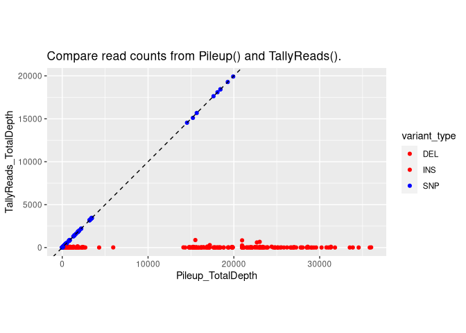

Test fixIndelREfCounts by comparing with tallyReads.
================
trichelab
06/25/2024

``` r
knitr::opts_chunk$set(fig.path='Figs/test.fixIndeRefCounts')
```

### Missing Total read counts for INDELs in tallyreads()

``` r
library(bamSliceR)
library(parallel)

# Parameter to tally the reads is:
#  TallyVariantsParam(gmapGenome, which = grs,
#            indels = TRUE, minimum_mapq = 0)

demo_res_file = system.file("data", "demo_tallyreads.rds", 
                            package = "bamSliceR")

demo_res = readRDS(demo_res_file)
INDEL_IDX = which(bamSliceR:::getVarType(demo_res) != "SNP")

summary(demo_res[INDEL_IDX]$VAF)
```

    ##    Min. 1st Qu.  Median    Mean 3rd Qu.    Max. 
    ##       1       1       1       1       1       1

### Use fixIndelRefCounts to re-pileup on variants ranges

``` r
demo_bam_dir = dirname(system.file("extdata", "leucegene.02H053.RNASeq.genomic.sliced.sorted.bam", 
                            package = "bamSliceR"))
paste0(demo_bam_dir, "/") -> demo_bam_dir
PileupParam = PileupParam(max_depth = 1e+06, min_mapq = 0,
            include_insertions = TRUE, distinguish_strands = FALSE,
            min_base_quality = 0)

fixIndelRefCounts(gr = demo_res, dir = demo_bam_dir, mode = "ALL", isFlank = FALSE,
                  totalDepthOnly = FALSE, PileupParam = PileupParam) -> demo_res_pileup

INDEL_IDX = which(bamSliceR:::getVarType(demo_res_pileup) != "SNP")

summary(demo_res_pileup[INDEL_IDX]$VAF)
```

    ##      Min.   1st Qu.    Median      Mean   3rd Qu.      Max. 
    ## 0.0001116 0.0004914 0.0094213 0.0714099 0.0802685 1.0000000

### pileup vs. tallyreads

Given the same min_mapq and min_base_quality, pileup() and tallyreads
should give the same read counts.

``` r
library(ggplot2)
data <- data.frame(x = demo_res_pileup$totalDepth, 
                   y = demo_res$totalDepth,
                   variant_type = bamSliceR:::getVarType(demo_res))

ggplot(data, aes(x = x, y = y, color = variant_type)) +
  geom_point() +
  coord_fixed(ratio = 1) +
  labs(
    title = "Compare read counts from Pileup() and TallyReads().",
    x = "Pileup_TotalDepth", y = "TallyReads_TotalDepth"
  ) +
  scale_color_manual(values = c("SNP" = "blue", "DEL" = "red", "INS" = "red")) +
  geom_abline(intercept = 0, slope = 1, color = "black", linetype = "dashed")
```

<!-- -->
